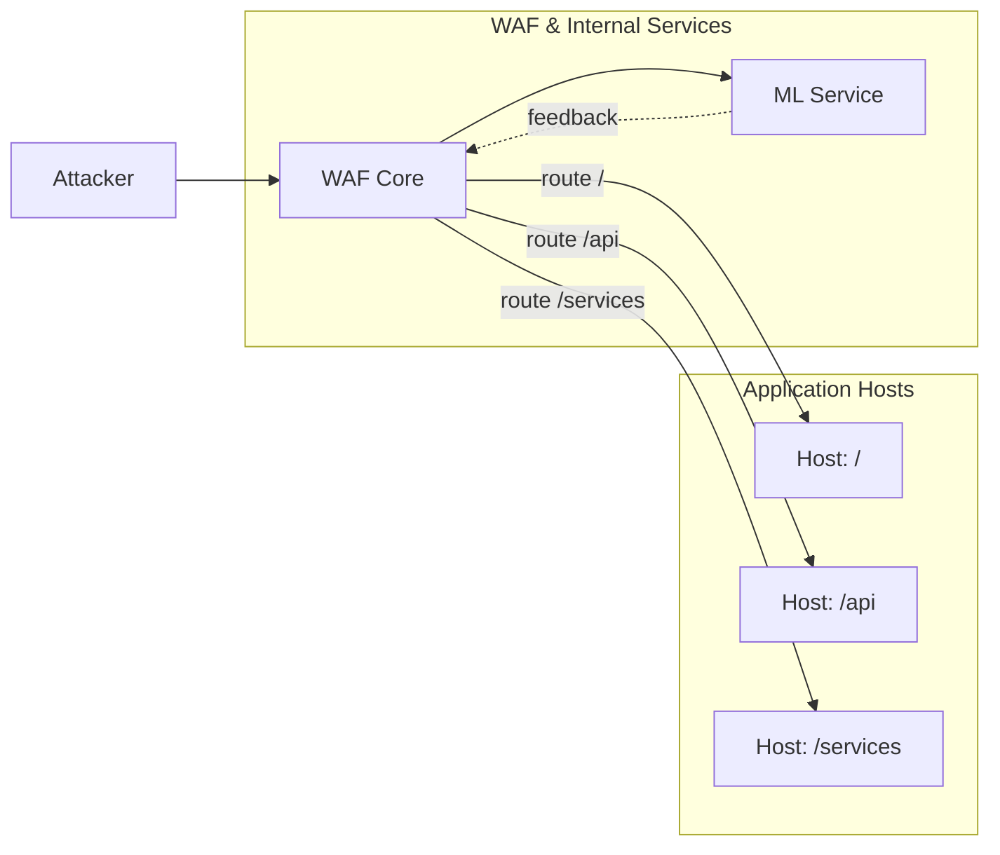
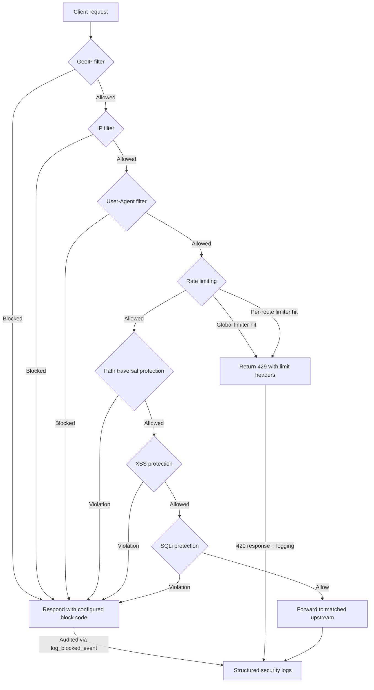

# NERDA WAF (Deploy)

เอกสารนี้อธิบายวิธีติดตั้งและใช้งาน NERDA WAF (Web Application Firewall) ด้วย Docker บนเครื่องพัฒนา รวมถึงการตั้งค่าเบื้องต้น การสร้างใบรับรอง TLS การใช้งาน UI และ API ตลอดจนแนวทางแก้ปัญหาเบื้องต้น

## ภาพรวมระบบ

โปรเจกต์นี้ประกอบด้วย 3 คอนเทนเนอร์หลัก (ดูใน `docker-compose.yaml`):

- wafcore: เอนจิน WAF ทำงานที่พอร์ต 8080 (HTTP) และ 9443 (HTTPS เมื่อเปิดใช้งาน TLS)
- wafui: เว็บ UI สำหรับบริหารจัดการ ทำงานที่พอร์ต 8081
- wafapi: API ที่ใช้บริหาร/บันทึกคอนฟิก ทำงานที่พอร์ต 8082

พอร์ตและเส้นทางสำคัญ (ค่าเริ่มต้น):

- WAF (Forward Proxy/Reverse Proxy):
  - HTTP: <http://localhost:8080>
  - HTTPS: <https://localhost:9443> (ต้องเปิดใช้งาน TLS ก่อน)
- UI: <http://localhost:8081>
- API: <http://localhost:8082> (กำหนดไว้ใน `public/config.js` เป็น `API_BASE`)

ไฟล์คอนฟิกหลัก:

- `config.docker.yaml` — คอนฟิกของ WAF Core (เส้นทาง, upstream, ปลั๊กอินป้องกัน, เรตลิมิต, IP filter, GeoIP ฯลฯ)
- `api.config.docker.yaml` — คอนฟิกของ WAF API (การยืนยันตัวตน, JWT, CORS, audit, brute-force protection ฯลฯ)
- `public/config.js` — คอนฟิกฝั่ง UI (ชี้ API URL และชื่อระบบ)

หมายเหตุสำหรับการใช้งานจริง (Production):

- โปรดเปลี่ยนชื่อไฟล์คอนฟิกเป็น:
  - `config.docker.yaml` → `config.yaml`
  - `api.config.docker.yaml` → `api.config.yaml`
- และอัปเดตการอ้างอิงในเครื่องมือ/คำสั่งให้ตรงกับชื่อใหม่ (เช่น docker-compose หรือ path ที่ mount เข้าคอนเทนเนอร์)

## แผนภาพภาพรวม (Mermaid)



## แผนภาพการทำงานของ WAF



## โครงสร้างโฟลเดอร์

- `certs/` ใบรับรองและกุญแจ TLS สำหรับใช้งาน HTTPS (มีสคริปต์ช่วยสร้างใน `scripts/`)
- `geoip/` ฐานข้อมูล GeoIP (`geolite2.mmdb`) สำหรับฟีเจอร์กรองตามประเทศ
- `log/` ไฟล์ล็อกของระบบ (`pingora-waf.log`)
- `payloads/` ไฟล์ตัวอย่าง payload (.txt) สำหรับนำเข้าในหน้า UI (XSS/SQLi/CMDi/Path Traversal)
- `public/` ไฟล์ UI แบบ static และ `config.js`
- `scripts/` สคริปต์สร้างใบรับรอง TLS สำหรับ Windows (PowerShell) และ Linux/macOS (Bash)

## ข้อกำหนดเบื้องต้น

- ติดตั้ง Docker และ Docker Compose (ใช้คำสั่งรูปแบบ `docker compose ...`)
- แนะนำให้ติดตั้ง OpenSSL เพื่อสร้างใบรับรองแบบ self-signed สำหรับทดสอบ

## เริ่มต้นใช้งาน (Quick Start)

1. ดึงอิมเมจและรันคอนเทนเนอร์

```powershell
cd c:\Projects\waf\deploy
docker compose pull
docker compose up -d
```

1. ตรวจสอบสถานะและล็อก

```powershell
docker compose ps
docker compose logs -f wafcore
```

1. เปิดใช้งาน

- UI: เปิดเบราว์เซอร์ไปที่ <http://localhost:8081>
- API: <http://localhost:8082> (UI จะเรียก API นี้ตามค่า `public/config.js`)
- WAF Proxy: ทดสอบผ่าน <http://localhost:8080> (หรือ <https://localhost:9443> เมื่อเปิด TLS)

หมายเหตุ: ค่าเริ่มต้นใน `config.docker.yaml` มีตัวอย่าง `upstreams` และ `routes` แล้ว คุณควรแก้ไขให้ตรงกับ backend ของคุณจริงก่อนใช้งานจริง

## เปิดใช้งาน TLS (HTTPS)

ค่าเริ่มต้น TLS ถูกปิด (`tls.enabled: false`). หากต้องการเปิด HTTPS:

1. สร้างใบรับรองแบบ self-signed (สำหรับทดสอบ)

- Windows (PowerShell):

```powershell
cd c:\Projects\waf\deploy
./scripts/generate_cert.ps1 -Domain localhost -Days 825
```

- Linux/macOS (Bash):

```bash
cd /c/Projects/waf/deploy   # ปรับเส้นทางตามระบบของคุณ
./scripts/generate_cert.sh localhost 825
```

สคริปต์จะสร้าง `certs/server.crt` และ `certs/server.key` และไฟล์ root CA (`rootCA.pem`) สำหรับการทดสอบในเครื่อง

1. แก้ไข `config.docker.yaml`

- ตั้งค่า:
  - `tls.enabled: true`
  - ตรวจสอบ `tls.cert_path` และ `tls.key_path` ให้ชี้ไปยัง `./certs/server.crt` และ `./certs/server.key` (ในคอนเทนเนอร์แมปเป็น `/app/certs/...` แล้วจาก `docker-compose.yaml`)

1. รีสตาร์ตบริการ

```powershell
docker compose restart wafcore
```

จากนั้นเข้าที่ <https://localhost:9443> (เบราว์เซอร์อาจเตือนเรื่องใบรับรอง self-signed ในสภาพแวดล้อมทดสอบ)

## การตั้งค่าและปรับแต่งสำคัญ

แก้ไขไฟล์ `config.docker.yaml` ตามต้องการ แล้วสั่งรีสตาร์ตคอนเทนเนอร์ที่เกี่ยวข้อง

- Upstreams และ Routes:
  - กำหนด backend ในส่วน `upstreams` และแมปเส้นทางใน `routes`
  - ตัวอย่าง: `/api/*` ชี้ไป `backend1` และเปิด `rate_limit` กับปลั๊กอินบางตัว

- ปลั๊กอินป้องกัน (Per-route และ Global):
  - XSS (`xss_protection`), Path Traversal (`path_traversal_protection`), Command Injection (`cmdi_protection`), SQLi (`sqli_protection`), User-Agent filter (`user_agent_filter`), GeoIP (`geoip_filter`) ฯลฯ
  - สามารถเปิด/ปิดและปรับ `patterns`/`keywords` ได้

- Rate Limiting:
  - ทั้งแบบ global (`rate_limit.enable_global_limiter`) และต่อเส้นทางใน `routes[*].rate_limit`

- IP Filter และ Real IP:
  - `ip_filter` สำหรับ whitelist/blacklist IP/ช่วง IP
  - `real_ip` กำหนด `trusted_proxies` และลำดับ header เพื่อระบุ IP จริงของผู้ใช้

- GeoIP:
  - ใช้ฐานข้อมูล `geoip/geolite2.mmdb` (แมปเข้าคอนเทนเนอร์แล้ว) และกำหนดประเทศที่อนุญาตในแต่ละ route ด้วย `geoip_countries`

- SQLi Protection แบบใช้โมเดลภายนอก:
  - `sqli_protection.enabled` ค่าเริ่มต้นเป็น `false`
  - หากใช้ ให้กำหนด `api_url`, `api_token`, และ `confidence_threshold` ให้เหมาะสม

ทุกครั้งที่แก้ไขไฟล์ ให้รีสตาร์ตคอนเทนเนอร์ที่เกี่ยวข้อง เช่น:

```powershell
docker compose restart wafcore
docker compose restart wafapi
```

## การตั้งค่า API และความปลอดภัย

ไฟล์ `api.config.docker.yaml` ควบคุมการยืนยันตัวตน, JWT, CORS และนโยบายความปลอดภัยอื่น ๆ:

- เปลี่ยนค่า `auth.jwt.secret` เป็นความยาว 256 บิต ที่คาดเดายาก ก่อนใช้งานจริง
- ผู้ใช้เริ่มต้น (`auth.admin_user`) อยู่ในไฟล์นี้ ตรวจสอบ/เปลี่ยนรหัสผ่านทันทีในสภาพแวดล้อมจริง
- เปิดใช้งาน CORS ตามความจำเป็น (`cors`)

UI จะเรียก API ตาม `public/config.js` (ค่าเริ่มต้น `API_BASE: 'http://localhost:8082'`). หากคุณปรับพอร์ตหรือโฮสต์ ให้แก้ไฟล์นี้แล้วรีสตาร์ต `wafui`:

```powershell
docker compose restart wafui
```

## การนำเข้า Payload ตัวอย่างผ่าน UI

ไปที่ UI > หน้า XSS / SQL Injection / Command Injection / Path Traversal แล้วกด "Import (.txt)" จากนั้นเลือกไฟล์ตัวอย่างในโฟลเดอร์ `payloads/` ตามประเภท:

- `*-patterns.txt` สำหรับ regex patterns (บรรทัดละ 1 รายการ)
- `*-keywords.txt` สำหรับคำค้นแบบข้อความธรรมดา (substring)
- `sqli-sample-both.txt` สำหรับโหมด "Auto classify"

ในหน้าต่าง import สามารถเลือก Merge หรือ Replace ข้อมูลเดิมได้ กด Save เพื่อบันทึกลงคอนฟิก

## ไฟล์ล็อกและการตรวจสอบสุขภาพระบบ

- ไฟล์ล็อกหลักของ WAF Core: `log/pingora-waf.log` (แมปเข้า `/app/log/...`)
- ตรวจดูล็อกแบบเรียลไทม์:

```powershell
docker compose logs -f wafcore
docker compose logs -f wafapi
docker compose logs -f wafui
```

- Healthcheck ของ `wafapi` ใช้ `nc` ภายในคอนเทนเนอร์ หากล้มเหลวคอนเทนเนอร์จะถูกรีสตาร์ตอัตโนมัติ

## อัปเดตเวอร์ชันอิมเมจ

```powershell
docker compose pull
docker compose up -d
```

## การแก้ปัญหาทั่วไป (Troubleshooting)

- พอร์ตชนกัน (port already in use): เปลี่ยนพอร์ตฝั่ง host ใน `docker-compose.yaml`
- TLS ไม่ทำงาน: ตรวจสอบ `tls.enabled: true`, เส้นทาง `cert_path`/`key_path` และการแมปโฟลเดอร์ `certs` ใน compose
- UI เข้าไม่ได้: ดู `public/config.js` ว่าชี้ API ถูกต้อง และ `wafapi` รันอยู่ที่พอร์ต 8082
- GeoIP ไม่ทำงาน: ตรวจสอบว่ามีไฟล์ `geoip/geolite2.mmdb` และเปิด `geoip_filter.enabled: true`
- ปลั๊กอินไม่บล็อก/จับได้ตามคาด: ตรวจสอบ patterns/keywords, ขนาด payload (`max_body_size`), และการเปิดฟีเจอร์ per-route

## ข้อควรระวังด้านความปลอดภัย

- อย่าเก็บโทเคน/รหัสผ่านจริงไว้ในไฟล์ที่อยู่ภายใต้เวอร์ชันคอนโทรล หากจำเป็นให้ใช้วิธี inject ผ่าน secret management หรือไฟล์ override นอก repo
- ค่าในตัวอย่าง (เช่น Telegram bot token, JWT secret) ต้องเปลี่ยนก่อนใช้งานจริง
- จำกัดการเข้าถึงพอร์ตบริหาร (8081/8082) ภายในเครือข่ายที่เชื่อถือได้เท่านั้น

## ใบอนุญาต

โปรดตรวจสอบไฟล์ใบอนุญาตของ repository หลัก หากไม่ได้ระบุ ถือว่าเอกสารนี้เป็นส่วนหนึ่งของโปรเจกต์เดียวกัน

---

หากต้องการความช่วยเหลือเพิ่มเติม โปรดเปิด Issue ใน repository หรือแนบรายละเอียดล็อก/คอนฟิกที่เกี่ยวข้อง (อย่าลืมปกปิดข้อมูลอ่อนไหว)
